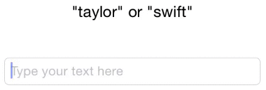

# SpecificationPattern

The **Specification** design pattern implemented in swift for iOS/OSX.

> In computer programming, the specification pattern is a particular software design pattern, whereby business rules can be recombined by chaining the business rules together using boolean logic.
>
> **Source:** [wikipedia.org](http://en.wikipedia.org/wiki/Specification_pattern)


## Requirements

- Xcode 7.0 beta 4 (7A165t)
- Swift 2
- iOS 9.0+ / Mac OS X 10.10+


## Usage

Chain two specifications into a single specification.

```swift
let s0 = RegularExpressionSpecification(pattern: "hello.*world")
let s1 = CountSpecification.between(20, 30)
let spec = s0 & s1

spec == "42"
# false, doesn't satify s0 and s1
spec == "hello world"
# false, s0 is satisfied, but not s1
spec == "say hello to the world today"
# true
```

## Useful classes

Beyond the specification pattern itself, this project provides the following iOS/OSX specifications

* CharacterSetSpecification - for ensuring all characters in a string are of a certain kind, eg. all digits
* CountSpecification - for ensuring that a string/array isn't too long or short
* EmailSpecification - decide if an email is valid or not
* PredicateSpecification - if you don't want to subclass you can use this and instead provide a closure 
* RegularExpressionSpecification - useful for string matching


## Operators

#### And operator

Use the `&` operator when two specifications both must be satisfied.


#### Or operator

Use the `|` operator when one of two specifications must be satisfied.


#### Not operator

Use the `!` operator when a specifications must not be satisfied.


#### Equal operator

Use the `==` operator to check if a candidate object satisfies the specification.


#### Not equal operator

Use the `!=` operator to check if a candidate object doesn't satisfy the specification.


## Example - Invoice handling

In the following example, we are retrieving invoices and sending them to a collection agency if

1. they are overdue,
2. notices have been sent, and
3. they are not already with the collection agency.

This example is meant to show the end result of how the logic is 'chained' together.

```swift
let overDue = OverDueSpecification()
let noticeSent = NoticeSentSpecification()
let inCollection = InCollectionSpecification()

// example of specification pattern logic chaining
let spec = overDue & noticeSent & !inCollection

for invoice in Service.invoices() where spec == invoice {
    invoice.sendToCollection()
}
```

## Sample project - Live text validation



The coloring are like this:

1. Red, when the text neither can be "taylor" nor "swift"
2. White, when the text is partially matching either "taylor" or "swift"
3. Green, when the text is exactly "taylor" or exactly "swift".

You find this in the Basic_iOS project in the Examples folder.


## Simon Strandgaard's App Projects

1. [SwiftyFORM](https://github.com/neoneye/SwiftyFORM) - A framework that makes it easier creating forms for iOS.
2. [Triangle Draw](http://www.triangledraw.com/) - A simple yet powerful drawing app for iOS.
3. [Colorblind Vision](https://itunes.apple.com/dk/app/colorblind-vision/id401516863?mt=8) - An app that processes live video and presents it as a colorblind person would see it, for iOS. 
4. [Newton Commander](https://github.com/neoneye/newton-commander) - An advanced file manager for Mac.
5. [GraphToy](https://github.com/neoneye/GraphToy) - A werkkzeug inspired tool for iPad.
6. [GraphicDesignerToolbox](http://graphicdesignertoolbox.com/) - A werkkzeug inspired tool for Mac.
7. [AEditor](https://github.com/neoneye/aeditor) - A programming editor for Mac/Windows/Linux.
